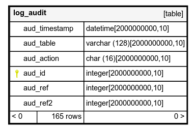

# hygs
How you grew smart – record of your projects, employers and skills.

As an IT-guy I change frameworks and libraries like clothes. After >30years of experience in general and >20years as employee it piled up. So I wondered how I grew smart and took modern means of statistics to lift this hidden treasure.

## Install it

You only need to load the DDL and DML of this repository:

```
sqlite3 your_capability.db ".read db/install_de.sql"
```

## Upgrade it

Use the upgrade.sh-script, to let it iterate through the scripts your instance needs. It'll do a backup first, next to the already existing database. But to stay on the safe side:

- copy your database
- upgrade the copy
- have a look at the copy
- either continue with the copy (delete origin, rename copy to origin)
- or repeat with origin


## Use it

Mind that all weighting is based on percentage ranging from 0..100. If you are employed fulltime for a project it's weight is 100%, which is the default value. This is the same for capabilities. If you work for example fulltime with Java and spend 10% of your time with Maven, then assign 10 to the prj_cap_mapping for Maven and use the default for Java.

* create employers in prj_company
* create projects in cap_project
* assign capabilities to projects with prj_cap_mapping
* assign your roles to the projects with prj_role_mapping

Special cases:

* Training: create project with weight of 50%, so time spent on the project counts half
* Fulltime project moved to maintenance: create two projects, one with 100% mapping, the other with the maintenance rate, e.g. 20%
* Multiple projects in parallel: create projects according to time slices and weight each accordingly, like A fulltime, then B partly overlapping with A 60% and B 40%: A1 with 100%, A2 with 60%, B with 40%

Recommended Tools

* SQLiteStudio, https://sqlitestudio.pl, full DDL-support
* SQLite Browser, https://sqlitebrowser.org/, poor trigger support in UI
* Schema Spy for schema documentation, http://schemaspy.org/

## SQLite

I was also plagued with tons of skill management tools of the various employers. I can't access them anymore so the information is lost. But I can carry around a SQLite database, on a thumb drive or even uploaded somewhere.

* small and lightweight
* SQL-support, incl. triggers, views and functions
* portable
* adaptable, like with PDO for PHP or JPA for Java or any other recent database-capable programming language
* fast

I thank the collegue who pointed out that unique feature, to carry around an entire database, designed for its only purpose.



 
## Data
 
* master data, like capabilities and categories, e.g. Java 8 as capability and Programming Language as a category
* dynamic data of your own, employers, projects
* mapping table of capabilities to projects, with weight
* views for calculations, like effective/ weighted months assigned to a project or effective months spent with a tool/ capability
* maintenance and auditing data, to keep the database stable and up to date

# For Developers

* for changes add a new script in either DML or DDL-directory
* increment version number in upgrade.sh, this'll be your file's name
* test locally with a sample database, incl. upgrade.sh
* record the script in install.template and invoke gen_install.sh to populate installation script(s)

## Eclipse/ Java-UI

* Needs a JDK-11 and Maven 3.6
* Pulls all other dependencies from the web, so without Internet you're lost
* ``mvn clean install`` – builds everything
* To run tests in Eclipse, -javaagent: needs to be set to a recent JMockit-JAR (use your home directory/ .m2/org/jmockit/...)

## Schemaspy

* make sure, Java 8 (or later) is installed on your system
* make sure, GraphViz is installed on your system (with Java-interface)
* get Schemaspy version from https://github.com/schemaspy, put into any/ new directory
* get JDBC-driver from https://github.com/xerial/sqlite-jdbc, put into same directory as Schemaspy
* create sqlite.properties (see below), put into same directory as Schemaspy
* create a target directory for Schemaspy-output (HTML, JavaScript, …)
* invoke Schemaspy from within Schemaspy-directory

Configuration file sqlite.properties for SQLite-JDBC-driver must match the
driver exactly. The example is using 3.27.2:

```
description=SQLite-Xerial
driver=org.sqlite.JDBC
driverPath=sqlite-jdbc-3.27.2.jar
connectionSpec=jdbc:sqlite:<db>
```

Invocation on command line:

```
# Render graphics to ~/Documents/hygs-schema -directory, complete cataloge,
# user (-u) and schema (-s) must be given but value is not used.
# Invocation for version other than 6.0.0 may differ
#
java -jar schemaspy-6.0.0.jar -t sqlite.properties \
  -dp ./sqlite-jdbc-3.27.2.jar 
  -db ~/git/hygs/db/sample_de.db 
  -o ~/Documents/hygs-schema -u dontcare -cat % -s dontcare
```
