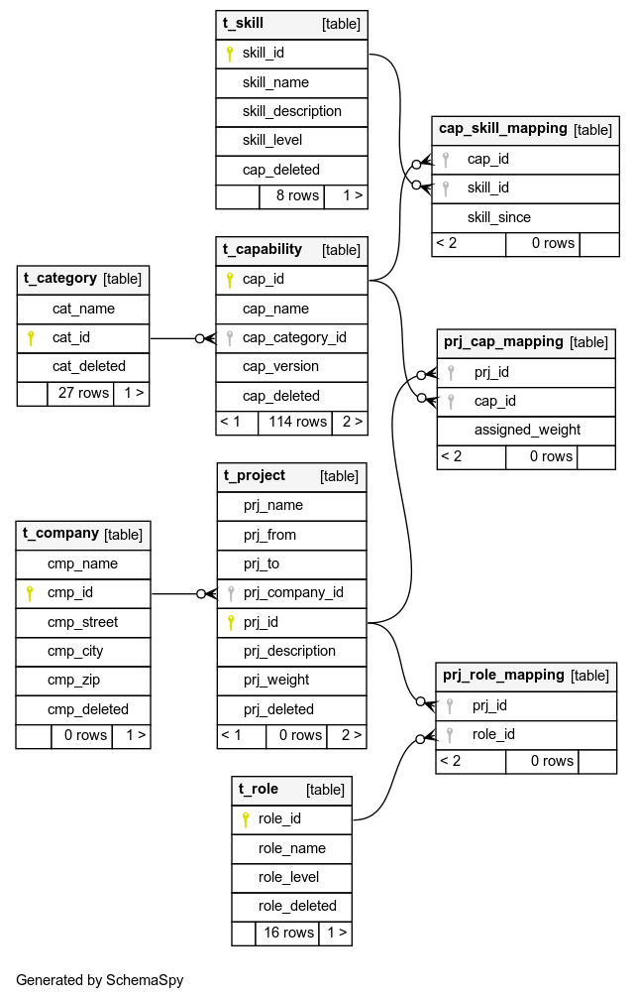
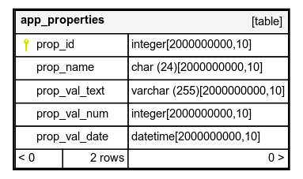

# hygs
How you grew smart – record of your projects, employers and skills.

Have a single SQLite database with

* companies – you worked for
* projects – what you did in the past and currently do
* capabilities – frameworks, tools and libraries you use, certificates you gained
* skills – levels of experience
* roles – what set of capabilities is needed

And now combine them

1. Insert the companies
1. Fill in the projects
1. Assign capabilities, skills and roles
1. Query the views

How many months you've been using an IDE? How fast you grew from a junior to a senior? How many years you worked in development compared to quality assurance/ testing/ architecture?

# Database

## Preconditions

* get SQLite 3
* optional get SQLiteStudio3, a UI for SQLite

## Init Database

Load the DDL and DML of this repository (currently only in German):

```
sqlite3 your_capability.db ".read db/install_de.sql"
```

## Upgrade Database

Use the upgrade.sh-script, to let it iterate through the scripts your instance needs. It'll do a backup first, next to the already existing database. But to stay on the safe side it will:

- copy your database
- upgrade the copy
- have a look at the copy
- either continue with the copy (delete origin, rename copy to origin)
- or repeat with origin

## Use Database

Mind that all weighting is based on percentage ranging from 0..100. If you are employed fulltime for a project it's weight is 100%, which is the default value. This is the same for capabilities. If you work for example fulltime with Java and spend 10% of your time with Maven, then assign 10 to the prj_cap_mapping for Maven and use the default for Java.

* create employers in t_company
* create projects in t_project
* assign capabilities to projects with prj_cap_mapping
* assign your roles to the projects with prj_role_mapping

Special cases:

* Training: create project with weight of 50%, so time spent on the project counts half
* Fulltime project moved to maintenance: create two projects, one with 100% mapping, the other with the maintenance rate, e.g. 20%
* Multiple projects in parallel: create projects according to time slices and weight each accordingly, like A fulltime, then B partly overlapping with A 60% and B 40%: A1 with 100%, A2 with 60%, B with 40%

## Migration/ Versioning

* for changes add a new script in either DML or DDL-directory
* increment version number in upgrade.sh, this'll be your file's name
* test locally with a sample database, incl. upgrade.sh
* record the script in install.template and invoke gen_install.sh to populate installation script(s)

## Schema







# Java UI

* Java 11
* Maven 3.6
* `cd ui && mvn clean install`

Limitations:

* cannot query the views
* cannot assign/ use skills


# Schemaspy

* for schema documentation, http://schemaspy.org/
* make sure, Java 8 (or later) is installed on your system
* make sure, GraphViz is installed on your system (with Java-interface)
* get Schemaspy version from https://github.com/schemaspy, put into any/ new directory
* get JDBC-driver from https://github.com/xerial/sqlite-jdbc, put into same directory as Schemaspy
* create a target directory for Schemaspy-output (HTML, JavaScript, …)
* invoke Schemaspy from within Schemaspy-directory

Invocation on command line:

```
# Render graphics to ~/Documents/hygs-schema -directory, complete cataloge,
# user (-u) and schema (-s) must be given but value is not used.
# Invocation for version other than 6.1.0 may differ. Type sqlite-xerial
# taken from -dbhelp
#
java -jar schemaspy-6.1.0.jar -t sqlite-xerial \
  -dp ./sqlite-jdbc-3.36.0.1.jar 
  -db ~/git/hygs/db/sample_de.db 
  -o ~/Documents/hygs-schema -u dontcare -cat % -s dontcare
```
